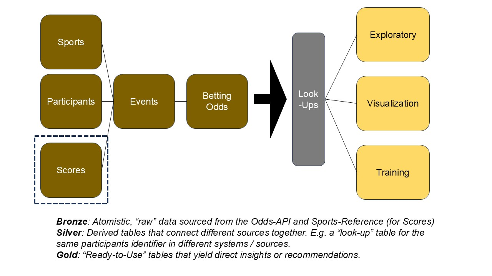

# Process Gambling

API for generating model outputs to support process-gambling.

## Requirements

- python 3.12
- Odds-API key: [Odds-API Subscription](https://dash.the-odds-api.com/api-subscriptions)

## Walkthrough

### Data Engineering

The above figure outlines the main data-flow of this project. In brief, I pull from odds-api and sports-reference e to build a dataset of teams-scores and associated betting odds going back a few years. 

In length, the extraction process is executed in a "waterfall" fashion where the most atomistic data elements are pulled from their respective APIs first (e.g., sports, scores). Then the participants for the associated sport are pulled, followed by the events at the documented start-times from the scores data. These dielements comprise the __Bronze Layer__ of the dataset, defined by their atomistic nature and lack of use-case specific curation. Their format is largely governed by the source rather than our project.

The __Silver Layer__ begins with "look-up" tables that connects participants and events in the scores datasource with the odds datasource to facilitate downstream joins. Other potential tables in the Silver Layer inclclude curated scores / odds data used to facilitate downstream joins / merges. The silver is a step above the Bronze Layer in that it is more directed to the specific use-case of this project (rather than the source system) but still contains independent data elements without direct insights or actions.

The __Gold Layer__ are the key results of the data and include test / training sets for ML model derivatioion, key visualizations, and other small, clean, interpretable datasets that underly key results and insights. In my experience, this is the data that executives or clients ask for without allocating resources to go from Bronze to Gold. 

### Modeling

- Exploratoy Data Analysis (EDA) is found in `process_gambling/notebooks/EDA.ipynb` 
- A model prototype is found in `process_gambling/notebooks/model_prototype.ipynb`

## Future Work

- Productionalize model prototype
- Schedule data pipeline for weekly data pulls, model outputs
- Display results on [personal website](www.scottpwhite.com) (temporarily hosted at http://3.19.58.181/. Website code is at [repo](https://github.com/spwhite1337/website)
